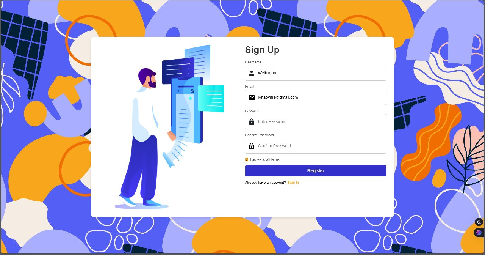

<h1 align="center">✅ ToDo List Web App</h1>

  

  <b>Современное веб-приложение для управления задачами</b>  
   Создавайте, редактируйте и управляйте своими задачами легко и удобно!

---

## 🚀 Функционал

✔️ Регистрация и авторизация пользователей  
✔️ Добавление, редактирование и удаление задач  
✔️ Установка дедлайнов и статусов задач  
✔️ Фильтрация и сортировка списка дел  

---

## 🛠️ Используемые технологии

| **Backend** | **Frontend** | **База данных** | **Аутентификация** |
|------------|------------|----------------|----------------|
| ASP.NET Core MVC | HTML, CSS, Bootstrap | Microsoft SQL Server | Identity Framework |

---

👨‍💻 Разработчики

Yaroslav

Alexey

📷 Скриншоты

 
 

🤝 Контакты
📧 Email: 
🌍 Telegram: @Yaroslav_ny
👨‍💻 GitHub: github.com/YaroslvN

